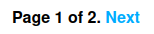
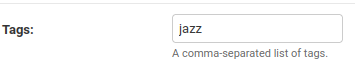
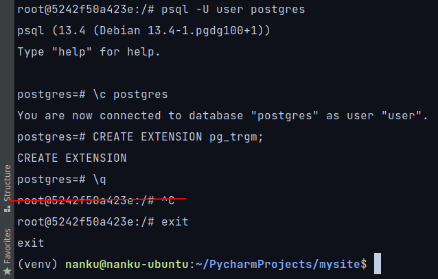

# Приложение "Блог", сделано по книге "Django 2 в примерах" Антонио Меле.

## Список фич для разработчика:
- Список статей
- Детальное отображение статьи
- Формирование каноничного URL
- Пагинация
- Комментирование статьи
- Поделиться статьей по e-mail
- Теги и фильтрация по тегу
- Рекомендованные статьи
- Создание собственных тегов
- Создание собственных фильтров
- django-environ
- Карта сайта
- RSS для статей
- Подключение БД PostgreSQL через `docker-compose.yaml`
- Полнотекстовый поиск с PostgreSQL

### Список статей
Чтобы отобразить список статей необходимо:
1. Модель
2. HTML-шаблон
3. URL-шаблон
4. View

#### Принцип действия:
Cписок статей - это обыкновенная модель из бд, поля которой отображаются в HTML-шаблоне.
URL-шаблон используется, чтобы запустить вьюху, по которой будет генерироваться HTML-шаблон.

### Детальное отображение статьи
Для детального отображения статьи необходимо:
1. Model `Post`
2. Метод get_absolute_url в модели `Post`
3. HTMl-шаблон `detail.html`
4. URL-шаблон
5. View `post_detail`

#### Принцип действия:
- Чтобы отобразить 1 статью из множества, необходимо использовать метод `get` менеджера контекста.
Однако чтобы отобразить 1 *опубликованную* статью, необходимо вначале изменить менеджер контекста с `objects` на 
`published` написав класс `PublishedManager` и создать поле в модели `Post` - `published = PublishedManager()`
- Необходимо сформировать каноничный URL, по которому мы будем переходить на страницу детального отображения статьи.
Для этого в модели `Post` определяем метод `get_absolute_url`, который формирует каноничный URL из полей модели 'Post':
`publish.year`, `publish.month`, `publish.day`, `slug`

### Формирование каноничного URL
Для формирования каноничного URL необходимо:
1. Модель `Post`
2. Метод `get_absolute_url` с ф-ей `reverse`
3. HTML-шаблон
4. URL-шаблон

#### Принцип действия:
Создаем модель. Внутри модели создаем метод `get_absolute_url`. В методе используем ф-ю reverse(URL-шаблон, поля модели).
Прокидываем метод `get_absolute_url` в HTML-шаблон.
Ф-я `reverse` собирает URL по URL-шаблону используя переданные в нее поля модели.

### Пагинация
*Пагинация* - ограничивает кол-во отображаемых статей на странице, с возможностью листать вперед-назад.
  

Чтобы сделать пагинацию необходимо в приложении blog создать:
1. Model `Post` 
2. Функция-обработчик (`post_list` in views)
3. HTML-шаблон для пагинации (`pagination.html`)
4. HTML-шаблон для списка, к которому применим пагинацию через 

#### Принцип действия:
- Берем список опубликованных статей `Post.publish.all()`, помещаем его в переменную `object_list` и 
передаем в класс `Paginator`, указав, сколько статей мы хотим отображать на странице - `Paginator(object_list,3)`.
- Определяем текущую страницу через request - `request.GET.get('page')`
(в словаре request есть словарь GET, в котором по ключу 'page' определяем номер страницы)
- Через `try except` определяем, когда все сработало нормально, то показываем те статьи,
которые соответствуют странице взятой из request `posts = paginator.page(page)`,
и описываем два исключения `EmptyList` - когда пользователь ввел страницу, которая больше максимальной страницы - 
перекидываем его на последнюю страницу `paginator.page(paginator.num_pages)`,
и `PageNotAnInteger` - когда пользователь ввел не число, то перекидываем его на первую страницу `paginator.page(1)`

### Комментирование статьи
Для реализации комментирования, нам понадобятся:
1. Model `Comment`
2. ModelForm `CommentForm`
3. HTML-шаблон в котором отображается детально статья и куда мы прокинем форму.
4. URL-шаблон, по которому будет формироваться view `post_detail`
5. View `post_detail`

#### Принцип действия:
Чтобы комментирование статьи работало, нам нужна форма, в которой мы будем писать коммент. После отправки этой формы
сработает вьюха `post_detail` и комментарий будет отображен на странице через HTML-шаблон.
Используем `ModelForm`, чтобы поля подтянулись из `Model`, тип полей для формы указываем в `Model`.

### Поделиться статьей по e-mail
Для реализации данной фичи необходимо:
1. Настройки smtp-сервера в setting.py
2. View
3. HTML-шаблон `detail.html` - здесь разместим ссылку на форму.
4. HTML-шаблон `share.html` - здесь разместим саму форму отправки на e-mail.
5. URL-шаблон
6. Form

#### Принцип действия:
- В Django есть свой `EMAIL_BACKEND`, он позволяет отправлять данные на e-mail.
- Прописываем `EMAIL_BACKEND` и настройки smtp-сервера в setting.py
- Создаем форму используя `forms.Form` (т.к нам не нужна модель для отправки статьи на e-mail).
- Создаем URL-шаблон `path('<int:post_id>/share/', views.post_share, name='post_share')` и вьюху `post_share`.
- Во вьюхе получаем queryset модели по id переданному на вход ф-и через URL-шаблон.
- Пишем стандартную логику для отправки письма используя `if request.method == 'POST'` и `is.valid()`
- Если данные валидны - собираем тело письма для ф-ии `sendmail`, которую мы импортируем из встроенного модуля
`django.core.mail` и отправляем письмо.
- Если данные не валидны - показываем пустую форму заново.

### Теги
Для реализации системы тегов необходимо:
1. Установить стороннее приложение django-taggit `pip install django-taggit`
2. Прописать приложение `taggit` в `INSTALLED_APPS`
3. Добавить в модель `Post` менеджер контекста `TaggableManager`
4. Сделать миграции
5. В админке появится строка Tags, в нее добавить теги для поста. 
6. URL-шаблон c `slug:tag_slug`
7. HTML-шаблон `list.html` в котором указываем тег.
8. View `post_list` с аргументом `tag_slug`

### Рекомендованные статьи
Данный функционал основан на тегах. Показывает все статьи, в которых есть тег текущей статьи.

### Создание собственных тегов
Есть 2 типа тегов:
- `simple_tag` – обрабатывает данные и возвращает строку;
- `inclusion_tag` – обрабатывает данные и возвращает сформированный фрагмент шаблона.  
Для `inclusion_tag` нужно создавать HTML-файл. 
`simple_tag` сразу размещается в готовых HTML-шаблонах.

1. В приложении `blog` создаем пакет `templatetags`
2. В пакете создаем модуль `blog_tags.py`
3. В модуле создаем собственные теги
4. Вызываем готовые теги в HTMl-шаблонах 

### Создание собственных фильтров
1. В уже созданном модуле `blog_tags.py` создаем собственный фильтр.
2. `pip install markdown `(для нашего фильтра это необходимо)
3. Применяем `` в HTML-шаблоне.
4. Применяем фильтр как обычный фильтр в HTML-шаблонах.

### Django-environ для скрытия важных данных
1. `pip install django-environ`
2. Создаем файл `.env`
3. Добавляем `.env` в `.gitignore`
4. Применяем `django-environ` в `settings.py` и других модулях.

### Карта сайта
Эта штука нужна для поисковых роботов, для лучшей индексации.
Делается просто:
1. В `settings.py` прописываем SITE_ID=1
2. Там же в `INSTALLED_APPS` добавляем 2 приложения `django.contrib.sites` и `django.contrib.sitemaps`
3. Делаем миграции
4. Создаем новый модуль в `blog` - `sitemaps.py`, в нем создаем класс `PostSitemap(Sitemap):`
5. Модифицируем `mysite/urls.py`, делаем импорты, создаем словарь `sitemaps` и прописываем `path`
6. В админке в разделе `SITES` меняем `example.com` на домен нашего сайта.

### RSS для статей
RSS-фид нужен, чтобы пользователи могли подписываться на рассылку статей нашего блога.
1. Создаем в приложении `blog` модуль `feeds.py`
2. В `feeds.py` создаем класс `LatestPostsFeed(Feed)`
3. В `blog/urls.py` создаем `path` для класса `LatestPostsFeed`
4. В HTML-шаблоне `base.html` добавляем ссылку на `path` - ``

### Подключение БД PostgreSQL через `docker-compose.yaml`
1. Создаем `docker-compose.yaml`
2. Меняем `DATABASES` в `settings.py`, сразу прячем в `.env`
3. `pip install psycopg2-binary, docker-compose`
4. `sudo docker-compose up postgres` - запускаем сервис Postgres через docker-compose.
5. Если порт `5432` занят, меняем на другой в `docker-compose.yaml` и `.env`
6. Делаем миграции.
7. Создаем суперюзера.
8. Наполняем бд заново статьями через админку.

### Полнотекстовый поиск с PostgreSQL
Важно: Данная реализация работает только с PostgreSQL!
В книге описано 4 вида поиска:
1. Поиск по нескольким полям
2. Стемминг и ранжирование результатов
3. Взвешенные запросы
4. Поиск с помощью триграмм - считается одним из наиболее качественных типов поиска.  
В коде приведен пример для поиска с помощью триграмм. 
Триграмма – это последовательность из трех символов. Вы можете измерить подобие двух строк,
подсчитав количество совпадений триграмм.
- Заходим в postgresql в докере:  `sudo docker exec -it 5242f50a423e bash`
- `psql -U user postgres`
- `CREATE EXTENSION pg_trgm;`  - создаем расширение `pg_trgm` необходимое для работы.

- создаем форму `SearchForm(forms.Form)`
- создаем ф-ю `post_search` в `views.py`
- создаем HTML-шаблон `search.html`
- прописываем `path` до него в `blog/urls.py`

Фича реализована криво. При similarity__gt=0.02 УЖЕ не работает.
Можно раскомментировать Поиск по нескольким полям.

